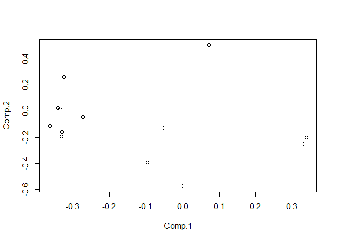

HW01-Bryan-Yan
================
Bryan
February 23, 2018

``` r
# set the working disk to offline github repository
setwd("/Users/shuai/Stat133/hw-stat133/hw01")
library("readr")


#2)
column_name <- c(
  'symboling',
  'normalized_losses',
  'make',
  'fuel_type',
  'aspiration',
  'num_of_doors',
  'body_style',
  'drive_wheels',
  'engine_location',
  'wheel_base',
  'length',
  'width',
  'height',
  'curb_weight',
  'engine_type',
  'num_of_cylinders',
  'engine_size',
  'fuel_system',
  'bore',
  'stroke',
  'compression_ratio',
  'horsepower',
  'peak_rpm',
  'city_mpg',
  'highway_mpg',
  'price'
  )


column_types <- c(
  'double',
  'character',
  'character',
  'character',
  'character',
  'character',
  'character',
  'character',
  'character',
  'double',
  'double',
  'double',
  'double',
  'integer',
  'character',
  'character',
  'integer',
  'character',
  'double',
  'double',
  'double',
  'integer',
  'integer',
  'integer',
  'integer',
  'integer'
  
)
#Follow the specifications listed above, import the data using the read.csv() function, and also display the structure with str()
a <- read.csv("imports-85.data", na = "?", col.names = column_name, colClasses = column_types)
names(a) <- column_name
str(a)
```

    ## 'data.frame':    204 obs. of  26 variables:
    ##  $ symboling        : num  3 1 2 2 2 1 1 1 0 2 ...
    ##  $ normalized_losses: chr  NA NA "164" "164" ...
    ##  $ make             : chr  "alfa-romero" "alfa-romero" "audi" "audi" ...
    ##  $ fuel_type        : chr  "gas" "gas" "gas" "gas" ...
    ##  $ aspiration       : chr  "std" "std" "std" "std" ...
    ##  $ num_of_doors     : chr  "two" "two" "four" "four" ...
    ##  $ body_style       : chr  "convertible" "hatchback" "sedan" "sedan" ...
    ##  $ drive_wheels     : chr  "rwd" "rwd" "fwd" "4wd" ...
    ##  $ engine_location  : chr  "front" "front" "front" "front" ...
    ##  $ wheel_base       : num  88.6 94.5 99.8 99.4 99.8 ...
    ##  $ length           : num  169 171 177 177 177 ...
    ##  $ width            : num  64.1 65.5 66.2 66.4 66.3 71.4 71.4 71.4 67.9 64.8 ...
    ##  $ height           : num  48.8 52.4 54.3 54.3 53.1 55.7 55.7 55.9 52 54.3 ...
    ##  $ curb_weight      : int  2548 2823 2337 2824 2507 2844 2954 3086 3053 2395 ...
    ##  $ engine_type      : chr  "dohc" "ohcv" "ohc" "ohc" ...
    ##  $ num_of_cylinders : chr  "four" "six" "four" "five" ...
    ##  $ engine_size      : int  130 152 109 136 136 136 136 131 131 108 ...
    ##  $ fuel_system      : chr  "mpfi" "mpfi" "mpfi" "mpfi" ...
    ##  $ bore             : num  3.47 2.68 3.19 3.19 3.19 3.19 3.19 3.13 3.13 3.5 ...
    ##  $ stroke           : num  2.68 3.47 3.4 3.4 3.4 3.4 3.4 3.4 3.4 2.8 ...
    ##  $ compression_ratio: num  9 9 10 8 8.5 8.5 8.5 8.3 7 8.8 ...
    ##  $ horsepower       : int  111 154 102 115 110 110 110 140 160 101 ...
    ##  $ peak_rpm         : int  5000 5000 5500 5500 5500 5500 5500 5500 5500 5800 ...
    ##  $ city_mpg         : int  21 19 24 18 19 19 19 17 16 23 ...
    ##  $ highway_mpg      : int  27 26 30 22 25 25 25 20 22 29 ...
    ##  $ price            : int  16500 16500 13950 17450 15250 17710 18920 23875 NA 16430 ...

``` r
#Follow the specifications listed above, import the data using the read_csv() function, and also display the structure with str()
a_2 <- read_csv('imports-85.data',na = "?", col_names = column_name, col_types= "ddcccccccddddiccicdddiiiii")
str(a_2)
```

    ## Classes 'tbl_df', 'tbl' and 'data.frame':    205 obs. of  26 variables:
    ##  $ symboling        : num  3 3 1 2 2 2 1 1 1 0 ...
    ##  $ normalized_losses: num  NA NA NA 164 164 NA 158 NA 158 NA ...
    ##  $ make             : chr  "alfa-romero" "alfa-romero" "alfa-romero" "audi" ...
    ##  $ fuel_type        : chr  "gas" "gas" "gas" "gas" ...
    ##  $ aspiration       : chr  "std" "std" "std" "std" ...
    ##  $ num_of_doors     : chr  "two" "two" "two" "four" ...
    ##  $ body_style       : chr  "convertible" "convertible" "hatchback" "sedan" ...
    ##  $ drive_wheels     : chr  "rwd" "rwd" "rwd" "fwd" ...
    ##  $ engine_location  : chr  "front" "front" "front" "front" ...
    ##  $ wheel_base       : num  88.6 88.6 94.5 99.8 99.4 ...
    ##  $ length           : num  169 169 171 177 177 ...
    ##  $ width            : num  64.1 64.1 65.5 66.2 66.4 66.3 71.4 71.4 71.4 67.9 ...
    ##  $ height           : num  48.8 48.8 52.4 54.3 54.3 53.1 55.7 55.7 55.9 52 ...
    ##  $ curb_weight      : int  2548 2548 2823 2337 2824 2507 2844 2954 3086 3053 ...
    ##  $ engine_type      : chr  "dohc" "dohc" "ohcv" "ohc" ...
    ##  $ num_of_cylinders : chr  "four" "four" "six" "four" ...
    ##  $ engine_size      : int  130 130 152 109 136 136 136 136 131 131 ...
    ##  $ fuel_system      : chr  "mpfi" "mpfi" "mpfi" "mpfi" ...
    ##  $ bore             : num  3.47 3.47 2.68 3.19 3.19 3.19 3.19 3.19 3.13 3.13 ...
    ##  $ stroke           : num  2.68 2.68 3.47 3.4 3.4 3.4 3.4 3.4 3.4 3.4 ...
    ##  $ compression_ratio: num  9 9 9 10 8 8.5 8.5 8.5 8.3 7 ...
    ##  $ horsepower       : int  111 111 154 102 115 110 110 110 140 160 ...
    ##  $ peak_rpm         : int  5000 5000 5000 5500 5500 5500 5500 5500 5500 5500 ...
    ##  $ city_mpg         : int  21 21 19 24 18 19 19 19 17 16 ...
    ##  $ highway_mpg      : int  27 27 26 30 22 25 25 25 20 22 ...
    ##  $ price            : int  13495 16500 16500 13950 17450 15250 17710 18920 23875 NA ...
    ##  - attr(*, "spec")=List of 2
    ##   ..$ cols   :List of 26
    ##   .. ..$ symboling        : list()
    ##   .. .. ..- attr(*, "class")= chr  "collector_double" "collector"
    ##   .. ..$ normalized_losses: list()
    ##   .. .. ..- attr(*, "class")= chr  "collector_double" "collector"
    ##   .. ..$ make             : list()
    ##   .. .. ..- attr(*, "class")= chr  "collector_character" "collector"
    ##   .. ..$ fuel_type        : list()
    ##   .. .. ..- attr(*, "class")= chr  "collector_character" "collector"
    ##   .. ..$ aspiration       : list()
    ##   .. .. ..- attr(*, "class")= chr  "collector_character" "collector"
    ##   .. ..$ num_of_doors     : list()
    ##   .. .. ..- attr(*, "class")= chr  "collector_character" "collector"
    ##   .. ..$ body_style       : list()
    ##   .. .. ..- attr(*, "class")= chr  "collector_character" "collector"
    ##   .. ..$ drive_wheels     : list()
    ##   .. .. ..- attr(*, "class")= chr  "collector_character" "collector"
    ##   .. ..$ engine_location  : list()
    ##   .. .. ..- attr(*, "class")= chr  "collector_character" "collector"
    ##   .. ..$ wheel_base       : list()
    ##   .. .. ..- attr(*, "class")= chr  "collector_double" "collector"
    ##   .. ..$ length           : list()
    ##   .. .. ..- attr(*, "class")= chr  "collector_double" "collector"
    ##   .. ..$ width            : list()
    ##   .. .. ..- attr(*, "class")= chr  "collector_double" "collector"
    ##   .. ..$ height           : list()
    ##   .. .. ..- attr(*, "class")= chr  "collector_double" "collector"
    ##   .. ..$ curb_weight      : list()
    ##   .. .. ..- attr(*, "class")= chr  "collector_integer" "collector"
    ##   .. ..$ engine_type      : list()
    ##   .. .. ..- attr(*, "class")= chr  "collector_character" "collector"
    ##   .. ..$ num_of_cylinders : list()
    ##   .. .. ..- attr(*, "class")= chr  "collector_character" "collector"
    ##   .. ..$ engine_size      : list()
    ##   .. .. ..- attr(*, "class")= chr  "collector_integer" "collector"
    ##   .. ..$ fuel_system      : list()
    ##   .. .. ..- attr(*, "class")= chr  "collector_character" "collector"
    ##   .. ..$ bore             : list()
    ##   .. .. ..- attr(*, "class")= chr  "collector_double" "collector"
    ##   .. ..$ stroke           : list()
    ##   .. .. ..- attr(*, "class")= chr  "collector_double" "collector"
    ##   .. ..$ compression_ratio: list()
    ##   .. .. ..- attr(*, "class")= chr  "collector_double" "collector"
    ##   .. ..$ horsepower       : list()
    ##   .. .. ..- attr(*, "class")= chr  "collector_integer" "collector"
    ##   .. ..$ peak_rpm         : list()
    ##   .. .. ..- attr(*, "class")= chr  "collector_integer" "collector"
    ##   .. ..$ city_mpg         : list()
    ##   .. .. ..- attr(*, "class")= chr  "collector_integer" "collector"
    ##   .. ..$ highway_mpg      : list()
    ##   .. .. ..- attr(*, "class")= chr  "collector_integer" "collector"
    ##   .. ..$ price            : list()
    ##   .. .. ..- attr(*, "class")= chr  "collector_integer" "collector"
    ##   ..$ default: list()
    ##   .. ..- attr(*, "class")= chr  "collector_guess" "collector"
    ##   ..- attr(*, "class")= chr "col_spec"

1.  

``` r
read.csv ('imports-85.data', header = FALSE)
```

    ##     V1  V2            V3     V4    V5   V6          V7  V8    V9   V10
    ## 1    3   ?   alfa-romero    gas   std  two convertible rwd front  88.6
    ## 2    3   ?   alfa-romero    gas   std  two convertible rwd front  88.6
    ## 3    1   ?   alfa-romero    gas   std  two   hatchback rwd front  94.5
    ## 4    2 164          audi    gas   std four       sedan fwd front  99.8
    ## 5    2 164          audi    gas   std four       sedan 4wd front  99.4
    ## 6    2   ?          audi    gas   std  two       sedan fwd front  99.8
    ## 7    1 158          audi    gas   std four       sedan fwd front 105.8
    ## 8    1   ?          audi    gas   std four       wagon fwd front 105.8
    ## 9    1 158          audi    gas turbo four       sedan fwd front 105.8
    ## 10   0   ?          audi    gas turbo  two   hatchback 4wd front  99.5
    ## 11   2 192           bmw    gas   std  two       sedan rwd front 101.2
    ## 12   0 192           bmw    gas   std four       sedan rwd front 101.2
    ## 13   0 188           bmw    gas   std  two       sedan rwd front 101.2
    ## 14   0 188           bmw    gas   std four       sedan rwd front 101.2
    ## 15   1   ?           bmw    gas   std four       sedan rwd front 103.5
    ## 16   0   ?           bmw    gas   std four       sedan rwd front 103.5
    ## 17   0   ?           bmw    gas   std  two       sedan rwd front 103.5
    ## 18   0   ?           bmw    gas   std four       sedan rwd front 110.0
    ## 19   2 121     chevrolet    gas   std  two   hatchback fwd front  88.4
    ## 20   1  98     chevrolet    gas   std  two   hatchback fwd front  94.5
    ## 21   0  81     chevrolet    gas   std four       sedan fwd front  94.5
    ## 22   1 118         dodge    gas   std  two   hatchback fwd front  93.7
    ## 23   1 118         dodge    gas   std  two   hatchback fwd front  93.7
    ## 24   1 118         dodge    gas turbo  two   hatchback fwd front  93.7
    ## 25   1 148         dodge    gas   std four   hatchback fwd front  93.7
    ## 26   1 148         dodge    gas   std four       sedan fwd front  93.7
    ## 27   1 148         dodge    gas   std four       sedan fwd front  93.7
    ## 28   1 148         dodge    gas turbo    ?       sedan fwd front  93.7
    ## 29  -1 110         dodge    gas   std four       wagon fwd front 103.3
    ## 30   3 145         dodge    gas turbo  two   hatchback fwd front  95.9
    ## 31   2 137         honda    gas   std  two   hatchback fwd front  86.6
    ## 32   2 137         honda    gas   std  two   hatchback fwd front  86.6
    ## 33   1 101         honda    gas   std  two   hatchback fwd front  93.7
    ## 34   1 101         honda    gas   std  two   hatchback fwd front  93.7
    ## 35   1 101         honda    gas   std  two   hatchback fwd front  93.7
    ## 36   0 110         honda    gas   std four       sedan fwd front  96.5
    ## 37   0  78         honda    gas   std four       wagon fwd front  96.5
    ## 38   0 106         honda    gas   std  two   hatchback fwd front  96.5
    ## 39   0 106         honda    gas   std  two   hatchback fwd front  96.5
    ## 40   0  85         honda    gas   std four       sedan fwd front  96.5
    ## 41   0  85         honda    gas   std four       sedan fwd front  96.5
    ## 42   0  85         honda    gas   std four       sedan fwd front  96.5
    ## 43   1 107         honda    gas   std  two       sedan fwd front  96.5
    ## 44   0   ?         isuzu    gas   std four       sedan rwd front  94.3
    ## 45   1   ?         isuzu    gas   std  two       sedan fwd front  94.5
    ## 46   0   ?         isuzu    gas   std four       sedan fwd front  94.5
    ## 47   2   ?         isuzu    gas   std  two   hatchback rwd front  96.0
    ## 48   0 145        jaguar    gas   std four       sedan rwd front 113.0
    ## 49   0   ?        jaguar    gas   std four       sedan rwd front 113.0
    ## 50   0   ?        jaguar    gas   std  two       sedan rwd front 102.0
    ## 51   1 104         mazda    gas   std  two   hatchback fwd front  93.1
    ## 52   1 104         mazda    gas   std  two   hatchback fwd front  93.1
    ## 53   1 104         mazda    gas   std  two   hatchback fwd front  93.1
    ## 54   1 113         mazda    gas   std four       sedan fwd front  93.1
    ## 55   1 113         mazda    gas   std four       sedan fwd front  93.1
    ## 56   3 150         mazda    gas   std  two   hatchback rwd front  95.3
    ## 57   3 150         mazda    gas   std  two   hatchback rwd front  95.3
    ## 58   3 150         mazda    gas   std  two   hatchback rwd front  95.3
    ## 59   3 150         mazda    gas   std  two   hatchback rwd front  95.3
    ## 60   1 129         mazda    gas   std  two   hatchback fwd front  98.8
    ## 61   0 115         mazda    gas   std four       sedan fwd front  98.8
    ## 62   1 129         mazda    gas   std  two   hatchback fwd front  98.8
    ## 63   0 115         mazda    gas   std four       sedan fwd front  98.8
    ## 64   0   ?         mazda diesel   std    ?       sedan fwd front  98.8
    ## 65   0 115         mazda    gas   std four   hatchback fwd front  98.8
    ## 66   0 118         mazda    gas   std four       sedan rwd front 104.9
    ## 67   0   ?         mazda diesel   std four       sedan rwd front 104.9
    ## 68  -1  93 mercedes-benz diesel turbo four       sedan rwd front 110.0
    ## 69  -1  93 mercedes-benz diesel turbo four       wagon rwd front 110.0
    ## 70   0  93 mercedes-benz diesel turbo  two     hardtop rwd front 106.7
    ## 71  -1  93 mercedes-benz diesel turbo four       sedan rwd front 115.6
    ## 72  -1   ? mercedes-benz    gas   std four       sedan rwd front 115.6
    ## 73   3 142 mercedes-benz    gas   std  two convertible rwd front  96.6
    ## 74   0   ? mercedes-benz    gas   std four       sedan rwd front 120.9
    ## 75   1   ? mercedes-benz    gas   std  two     hardtop rwd front 112.0
    ## 76   1   ?       mercury    gas turbo  two   hatchback rwd front 102.7
    ## 77   2 161    mitsubishi    gas   std  two   hatchback fwd front  93.7
    ## 78   2 161    mitsubishi    gas   std  two   hatchback fwd front  93.7
    ## 79   2 161    mitsubishi    gas   std  two   hatchback fwd front  93.7
    ## 80   1 161    mitsubishi    gas turbo  two   hatchback fwd front  93.0
    ## 81   3 153    mitsubishi    gas turbo  two   hatchback fwd front  96.3
    ## 82   3 153    mitsubishi    gas   std  two   hatchback fwd front  96.3
    ## 83   3   ?    mitsubishi    gas turbo  two   hatchback fwd front  95.9
    ## 84   3   ?    mitsubishi    gas turbo  two   hatchback fwd front  95.9
    ## 85   3   ?    mitsubishi    gas turbo  two   hatchback fwd front  95.9
    ## 86   1 125    mitsubishi    gas   std four       sedan fwd front  96.3
    ## 87   1 125    mitsubishi    gas   std four       sedan fwd front  96.3
    ## 88   1 125    mitsubishi    gas turbo four       sedan fwd front  96.3
    ## 89  -1 137    mitsubishi    gas   std four       sedan fwd front  96.3
    ## 90   1 128        nissan    gas   std  two       sedan fwd front  94.5
    ## 91   1 128        nissan diesel   std  two       sedan fwd front  94.5
    ## 92   1 128        nissan    gas   std  two       sedan fwd front  94.5
    ## 93   1 122        nissan    gas   std four       sedan fwd front  94.5
    ## 94   1 103        nissan    gas   std four       wagon fwd front  94.5
    ## 95   1 128        nissan    gas   std  two       sedan fwd front  94.5
    ## 96   1 128        nissan    gas   std  two   hatchback fwd front  94.5
    ## 97   1 122        nissan    gas   std four       sedan fwd front  94.5
    ## 98   1 103        nissan    gas   std four       wagon fwd front  94.5
    ## 99   2 168        nissan    gas   std  two     hardtop fwd front  95.1
    ## 100  0 106        nissan    gas   std four   hatchback fwd front  97.2
    ## 101  0 106        nissan    gas   std four       sedan fwd front  97.2
    ## 102  0 128        nissan    gas   std four       sedan fwd front 100.4
    ## 103  0 108        nissan    gas   std four       wagon fwd front 100.4
    ## 104  0 108        nissan    gas   std four       sedan fwd front 100.4
    ## 105  3 194        nissan    gas   std  two   hatchback rwd front  91.3
    ## 106  3 194        nissan    gas turbo  two   hatchback rwd front  91.3
    ## 107  1 231        nissan    gas   std  two   hatchback rwd front  99.2
    ## 108  0 161        peugot    gas   std four       sedan rwd front 107.9
    ## 109  0 161        peugot diesel turbo four       sedan rwd front 107.9
    ## 110  0   ?        peugot    gas   std four       wagon rwd front 114.2
    ## 111  0   ?        peugot diesel turbo four       wagon rwd front 114.2
    ## 112  0 161        peugot    gas   std four       sedan rwd front 107.9
    ## 113  0 161        peugot diesel turbo four       sedan rwd front 107.9
    ## 114  0   ?        peugot    gas   std four       wagon rwd front 114.2
    ## 115  0   ?        peugot diesel turbo four       wagon rwd front 114.2
    ## 116  0 161        peugot    gas   std four       sedan rwd front 107.9
    ## 117  0 161        peugot diesel turbo four       sedan rwd front 107.9
    ## 118  0 161        peugot    gas turbo four       sedan rwd front 108.0
    ## 119  1 119      plymouth    gas   std  two   hatchback fwd front  93.7
    ## 120  1 119      plymouth    gas turbo  two   hatchback fwd front  93.7
    ## 121  1 154      plymouth    gas   std four   hatchback fwd front  93.7
    ## 122  1 154      plymouth    gas   std four       sedan fwd front  93.7
    ## 123  1 154      plymouth    gas   std four       sedan fwd front  93.7
    ## 124 -1  74      plymouth    gas   std four       wagon fwd front 103.3
    ## 125  3   ?      plymouth    gas turbo  two   hatchback rwd front  95.9
    ## 126  3 186       porsche    gas   std  two   hatchback rwd front  94.5
    ## 127  3   ?       porsche    gas   std  two     hardtop rwd  rear  89.5
    ## 128  3   ?       porsche    gas   std  two     hardtop rwd  rear  89.5
    ## 129  3   ?       porsche    gas   std  two convertible rwd  rear  89.5
    ## 130  1   ?       porsche    gas   std  two   hatchback rwd front  98.4
    ## 131  0   ?       renault    gas   std four       wagon fwd front  96.1
    ## 132  2   ?       renault    gas   std  two   hatchback fwd front  96.1
    ## 133  3 150          saab    gas   std  two   hatchback fwd front  99.1
    ## 134  2 104          saab    gas   std four       sedan fwd front  99.1
    ## 135  3 150          saab    gas   std  two   hatchback fwd front  99.1
    ## 136  2 104          saab    gas   std four       sedan fwd front  99.1
    ## 137  3 150          saab    gas turbo  two   hatchback fwd front  99.1
    ## 138  2 104          saab    gas turbo four       sedan fwd front  99.1
    ## 139  2  83        subaru    gas   std  two   hatchback fwd front  93.7
    ## 140  2  83        subaru    gas   std  two   hatchback fwd front  93.7
    ## 141  2  83        subaru    gas   std  two   hatchback 4wd front  93.3
    ## 142  0 102        subaru    gas   std four       sedan fwd front  97.2
    ## 143  0 102        subaru    gas   std four       sedan fwd front  97.2
    ## 144  0 102        subaru    gas   std four       sedan fwd front  97.2
    ## 145  0 102        subaru    gas   std four       sedan 4wd front  97.0
    ## 146  0 102        subaru    gas turbo four       sedan 4wd front  97.0
    ## 147  0  89        subaru    gas   std four       wagon fwd front  97.0
    ## 148  0  89        subaru    gas   std four       wagon fwd front  97.0
    ## 149  0  85        subaru    gas   std four       wagon 4wd front  96.9
    ## 150  0  85        subaru    gas turbo four       wagon 4wd front  96.9
    ## 151  1  87        toyota    gas   std  two   hatchback fwd front  95.7
    ## 152  1  87        toyota    gas   std  two   hatchback fwd front  95.7
    ## 153  1  74        toyota    gas   std four   hatchback fwd front  95.7
    ## 154  0  77        toyota    gas   std four       wagon fwd front  95.7
    ## 155  0  81        toyota    gas   std four       wagon 4wd front  95.7
    ## 156  0  91        toyota    gas   std four       wagon 4wd front  95.7
    ## 157  0  91        toyota    gas   std four       sedan fwd front  95.7
    ## 158  0  91        toyota    gas   std four   hatchback fwd front  95.7
    ## 159  0  91        toyota diesel   std four       sedan fwd front  95.7
    ## 160  0  91        toyota diesel   std four   hatchback fwd front  95.7
    ## 161  0  91        toyota    gas   std four       sedan fwd front  95.7
    ## 162  0  91        toyota    gas   std four   hatchback fwd front  95.7
    ## 163  0  91        toyota    gas   std four       sedan fwd front  95.7
    ## 164  1 168        toyota    gas   std  two       sedan rwd front  94.5
    ## 165  1 168        toyota    gas   std  two   hatchback rwd front  94.5
    ## 166  1 168        toyota    gas   std  two       sedan rwd front  94.5
    ## 167  1 168        toyota    gas   std  two   hatchback rwd front  94.5
    ## 168  2 134        toyota    gas   std  two     hardtop rwd front  98.4
    ## 169  2 134        toyota    gas   std  two     hardtop rwd front  98.4
    ## 170  2 134        toyota    gas   std  two   hatchback rwd front  98.4
    ## 171  2 134        toyota    gas   std  two     hardtop rwd front  98.4
    ## 172  2 134        toyota    gas   std  two   hatchback rwd front  98.4
    ## 173  2 134        toyota    gas   std  two convertible rwd front  98.4
    ## 174 -1  65        toyota    gas   std four       sedan fwd front 102.4
    ## 175 -1  65        toyota diesel turbo four       sedan fwd front 102.4
    ## 176 -1  65        toyota    gas   std four   hatchback fwd front 102.4
    ## 177 -1  65        toyota    gas   std four       sedan fwd front 102.4
    ## 178 -1  65        toyota    gas   std four   hatchback fwd front 102.4
    ## 179  3 197        toyota    gas   std  two   hatchback rwd front 102.9
    ## 180  3 197        toyota    gas   std  two   hatchback rwd front 102.9
    ## 181 -1  90        toyota    gas   std four       sedan rwd front 104.5
    ## 182 -1   ?        toyota    gas   std four       wagon rwd front 104.5
    ## 183  2 122    volkswagen diesel   std  two       sedan fwd front  97.3
    ## 184  2 122    volkswagen    gas   std  two       sedan fwd front  97.3
    ## 185  2  94    volkswagen diesel   std four       sedan fwd front  97.3
    ## 186  2  94    volkswagen    gas   std four       sedan fwd front  97.3
    ## 187  2  94    volkswagen    gas   std four       sedan fwd front  97.3
    ## 188  2  94    volkswagen diesel turbo four       sedan fwd front  97.3
    ## 189  2  94    volkswagen    gas   std four       sedan fwd front  97.3
    ## 190  3   ?    volkswagen    gas   std  two convertible fwd front  94.5
    ## 191  3 256    volkswagen    gas   std  two   hatchback fwd front  94.5
    ## 192  0   ?    volkswagen    gas   std four       sedan fwd front 100.4
    ## 193  0   ?    volkswagen diesel turbo four       sedan fwd front 100.4
    ## 194  0   ?    volkswagen    gas   std four       wagon fwd front 100.4
    ## 195 -2 103         volvo    gas   std four       sedan rwd front 104.3
    ## 196 -1  74         volvo    gas   std four       wagon rwd front 104.3
    ## 197 -2 103         volvo    gas   std four       sedan rwd front 104.3
    ## 198 -1  74         volvo    gas   std four       wagon rwd front 104.3
    ## 199 -2 103         volvo    gas turbo four       sedan rwd front 104.3
    ## 200 -1  74         volvo    gas turbo four       wagon rwd front 104.3
    ## 201 -1  95         volvo    gas   std four       sedan rwd front 109.1
    ## 202 -1  95         volvo    gas turbo four       sedan rwd front 109.1
    ## 203 -1  95         volvo    gas   std four       sedan rwd front 109.1
    ## 204 -1  95         volvo diesel turbo four       sedan rwd front 109.1
    ## 205 -1  95         volvo    gas turbo four       sedan rwd front 109.1
    ##       V11  V12  V13  V14   V15    V16 V17  V18  V19  V20   V21 V22  V23
    ## 1   168.8 64.1 48.8 2548  dohc   four 130 mpfi 3.47 2.68  9.00 111 5000
    ## 2   168.8 64.1 48.8 2548  dohc   four 130 mpfi 3.47 2.68  9.00 111 5000
    ## 3   171.2 65.5 52.4 2823  ohcv    six 152 mpfi 2.68 3.47  9.00 154 5000
    ## 4   176.6 66.2 54.3 2337   ohc   four 109 mpfi 3.19 3.40 10.00 102 5500
    ## 5   176.6 66.4 54.3 2824   ohc   five 136 mpfi 3.19 3.40  8.00 115 5500
    ## 6   177.3 66.3 53.1 2507   ohc   five 136 mpfi 3.19 3.40  8.50 110 5500
    ## 7   192.7 71.4 55.7 2844   ohc   five 136 mpfi 3.19 3.40  8.50 110 5500
    ## 8   192.7 71.4 55.7 2954   ohc   five 136 mpfi 3.19 3.40  8.50 110 5500
    ## 9   192.7 71.4 55.9 3086   ohc   five 131 mpfi 3.13 3.40  8.30 140 5500
    ## 10  178.2 67.9 52.0 3053   ohc   five 131 mpfi 3.13 3.40  7.00 160 5500
    ## 11  176.8 64.8 54.3 2395   ohc   four 108 mpfi 3.50 2.80  8.80 101 5800
    ## 12  176.8 64.8 54.3 2395   ohc   four 108 mpfi 3.50 2.80  8.80 101 5800
    ## 13  176.8 64.8 54.3 2710   ohc    six 164 mpfi 3.31 3.19  9.00 121 4250
    ## 14  176.8 64.8 54.3 2765   ohc    six 164 mpfi 3.31 3.19  9.00 121 4250
    ## 15  189.0 66.9 55.7 3055   ohc    six 164 mpfi 3.31 3.19  9.00 121 4250
    ## 16  189.0 66.9 55.7 3230   ohc    six 209 mpfi 3.62 3.39  8.00 182 5400
    ## 17  193.8 67.9 53.7 3380   ohc    six 209 mpfi 3.62 3.39  8.00 182 5400
    ## 18  197.0 70.9 56.3 3505   ohc    six 209 mpfi 3.62 3.39  8.00 182 5400
    ## 19  141.1 60.3 53.2 1488     l  three  61 2bbl 2.91 3.03  9.50  48 5100
    ## 20  155.9 63.6 52.0 1874   ohc   four  90 2bbl 3.03 3.11  9.60  70 5400
    ## 21  158.8 63.6 52.0 1909   ohc   four  90 2bbl 3.03 3.11  9.60  70 5400
    ## 22  157.3 63.8 50.8 1876   ohc   four  90 2bbl 2.97 3.23  9.41  68 5500
    ## 23  157.3 63.8 50.8 1876   ohc   four  90 2bbl 2.97 3.23  9.40  68 5500
    ## 24  157.3 63.8 50.8 2128   ohc   four  98 mpfi 3.03 3.39  7.60 102 5500
    ## 25  157.3 63.8 50.6 1967   ohc   four  90 2bbl 2.97 3.23  9.40  68 5500
    ## 26  157.3 63.8 50.6 1989   ohc   four  90 2bbl 2.97 3.23  9.40  68 5500
    ## 27  157.3 63.8 50.6 1989   ohc   four  90 2bbl 2.97 3.23  9.40  68 5500
    ## 28  157.3 63.8 50.6 2191   ohc   four  98 mpfi 3.03 3.39  7.60 102 5500
    ## 29  174.6 64.6 59.8 2535   ohc   four 122 2bbl 3.34 3.46  8.50  88 5000
    ## 30  173.2 66.3 50.2 2811   ohc   four 156  mfi 3.60 3.90  7.00 145 5000
    ## 31  144.6 63.9 50.8 1713   ohc   four  92 1bbl 2.91 3.41  9.60  58 4800
    ## 32  144.6 63.9 50.8 1819   ohc   four  92 1bbl 2.91 3.41  9.20  76 6000
    ## 33  150.0 64.0 52.6 1837   ohc   four  79 1bbl 2.91 3.07 10.10  60 5500
    ## 34  150.0 64.0 52.6 1940   ohc   four  92 1bbl 2.91 3.41  9.20  76 6000
    ## 35  150.0 64.0 52.6 1956   ohc   four  92 1bbl 2.91 3.41  9.20  76 6000
    ## 36  163.4 64.0 54.5 2010   ohc   four  92 1bbl 2.91 3.41  9.20  76 6000
    ## 37  157.1 63.9 58.3 2024   ohc   four  92 1bbl 2.92 3.41  9.20  76 6000
    ## 38  167.5 65.2 53.3 2236   ohc   four 110 1bbl 3.15 3.58  9.00  86 5800
    ## 39  167.5 65.2 53.3 2289   ohc   four 110 1bbl 3.15 3.58  9.00  86 5800
    ## 40  175.4 65.2 54.1 2304   ohc   four 110 1bbl 3.15 3.58  9.00  86 5800
    ## 41  175.4 62.5 54.1 2372   ohc   four 110 1bbl 3.15 3.58  9.00  86 5800
    ## 42  175.4 65.2 54.1 2465   ohc   four 110 mpfi 3.15 3.58  9.00 101 5800
    ## 43  169.1 66.0 51.0 2293   ohc   four 110 2bbl 3.15 3.58  9.10 100 5500
    ## 44  170.7 61.8 53.5 2337   ohc   four 111 2bbl 3.31 3.23  8.50  78 4800
    ## 45  155.9 63.6 52.0 1874   ohc   four  90 2bbl 3.03 3.11  9.60  70 5400
    ## 46  155.9 63.6 52.0 1909   ohc   four  90 2bbl 3.03 3.11  9.60  70 5400
    ## 47  172.6 65.2 51.4 2734   ohc   four 119 spfi 3.43 3.23  9.20  90 5000
    ## 48  199.6 69.6 52.8 4066  dohc    six 258 mpfi 3.63 4.17  8.10 176 4750
    ## 49  199.6 69.6 52.8 4066  dohc    six 258 mpfi 3.63 4.17  8.10 176 4750
    ## 50  191.7 70.6 47.8 3950  ohcv twelve 326 mpfi 3.54 2.76 11.50 262 5000
    ## 51  159.1 64.2 54.1 1890   ohc   four  91 2bbl 3.03 3.15  9.00  68 5000
    ## 52  159.1 64.2 54.1 1900   ohc   four  91 2bbl 3.03 3.15  9.00  68 5000
    ## 53  159.1 64.2 54.1 1905   ohc   four  91 2bbl 3.03 3.15  9.00  68 5000
    ## 54  166.8 64.2 54.1 1945   ohc   four  91 2bbl 3.03 3.15  9.00  68 5000
    ## 55  166.8 64.2 54.1 1950   ohc   four  91 2bbl 3.08 3.15  9.00  68 5000
    ## 56  169.0 65.7 49.6 2380 rotor    two  70 4bbl    ?    ?  9.40 101 6000
    ## 57  169.0 65.7 49.6 2380 rotor    two  70 4bbl    ?    ?  9.40 101 6000
    ## 58  169.0 65.7 49.6 2385 rotor    two  70 4bbl    ?    ?  9.40 101 6000
    ## 59  169.0 65.7 49.6 2500 rotor    two  80 mpfi    ?    ?  9.40 135 6000
    ## 60  177.8 66.5 53.7 2385   ohc   four 122 2bbl 3.39 3.39  8.60  84 4800
    ## 61  177.8 66.5 55.5 2410   ohc   four 122 2bbl 3.39 3.39  8.60  84 4800
    ## 62  177.8 66.5 53.7 2385   ohc   four 122 2bbl 3.39 3.39  8.60  84 4800
    ## 63  177.8 66.5 55.5 2410   ohc   four 122 2bbl 3.39 3.39  8.60  84 4800
    ## 64  177.8 66.5 55.5 2443   ohc   four 122  idi 3.39 3.39 22.70  64 4650
    ## 65  177.8 66.5 55.5 2425   ohc   four 122 2bbl 3.39 3.39  8.60  84 4800
    ## 66  175.0 66.1 54.4 2670   ohc   four 140 mpfi 3.76 3.16  8.00 120 5000
    ## 67  175.0 66.1 54.4 2700   ohc   four 134  idi 3.43 3.64 22.00  72 4200
    ## 68  190.9 70.3 56.5 3515   ohc   five 183  idi 3.58 3.64 21.50 123 4350
    ## 69  190.9 70.3 58.7 3750   ohc   five 183  idi 3.58 3.64 21.50 123 4350
    ## 70  187.5 70.3 54.9 3495   ohc   five 183  idi 3.58 3.64 21.50 123 4350
    ## 71  202.6 71.7 56.3 3770   ohc   five 183  idi 3.58 3.64 21.50 123 4350
    ## 72  202.6 71.7 56.5 3740  ohcv  eight 234 mpfi 3.46 3.10  8.30 155 4750
    ## 73  180.3 70.5 50.8 3685  ohcv  eight 234 mpfi 3.46 3.10  8.30 155 4750
    ## 74  208.1 71.7 56.7 3900  ohcv  eight 308 mpfi 3.80 3.35  8.00 184 4500
    ## 75  199.2 72.0 55.4 3715  ohcv  eight 304 mpfi 3.80 3.35  8.00 184 4500
    ## 76  178.4 68.0 54.8 2910   ohc   four 140 mpfi 3.78 3.12  8.00 175 5000
    ## 77  157.3 64.4 50.8 1918   ohc   four  92 2bbl 2.97 3.23  9.40  68 5500
    ## 78  157.3 64.4 50.8 1944   ohc   four  92 2bbl 2.97 3.23  9.40  68 5500
    ## 79  157.3 64.4 50.8 2004   ohc   four  92 2bbl 2.97 3.23  9.40  68 5500
    ## 80  157.3 63.8 50.8 2145   ohc   four  98 spdi 3.03 3.39  7.60 102 5500
    ## 81  173.0 65.4 49.4 2370   ohc   four 110 spdi 3.17 3.46  7.50 116 5500
    ## 82  173.0 65.4 49.4 2328   ohc   four 122 2bbl 3.35 3.46  8.50  88 5000
    ## 83  173.2 66.3 50.2 2833   ohc   four 156 spdi 3.58 3.86  7.00 145 5000
    ## 84  173.2 66.3 50.2 2921   ohc   four 156 spdi 3.59 3.86  7.00 145 5000
    ## 85  173.2 66.3 50.2 2926   ohc   four 156 spdi 3.59 3.86  7.00 145 5000
    ## 86  172.4 65.4 51.6 2365   ohc   four 122 2bbl 3.35 3.46  8.50  88 5000
    ## 87  172.4 65.4 51.6 2405   ohc   four 122 2bbl 3.35 3.46  8.50  88 5000
    ## 88  172.4 65.4 51.6 2403   ohc   four 110 spdi 3.17 3.46  7.50 116 5500
    ## 89  172.4 65.4 51.6 2403   ohc   four 110 spdi 3.17 3.46  7.50 116 5500
    ## 90  165.3 63.8 54.5 1889   ohc   four  97 2bbl 3.15 3.29  9.40  69 5200
    ## 91  165.3 63.8 54.5 2017   ohc   four 103  idi 2.99 3.47 21.90  55 4800
    ## 92  165.3 63.8 54.5 1918   ohc   four  97 2bbl 3.15 3.29  9.40  69 5200
    ## 93  165.3 63.8 54.5 1938   ohc   four  97 2bbl 3.15 3.29  9.40  69 5200
    ## 94  170.2 63.8 53.5 2024   ohc   four  97 2bbl 3.15 3.29  9.40  69 5200
    ## 95  165.3 63.8 54.5 1951   ohc   four  97 2bbl 3.15 3.29  9.40  69 5200
    ## 96  165.6 63.8 53.3 2028   ohc   four  97 2bbl 3.15 3.29  9.40  69 5200
    ## 97  165.3 63.8 54.5 1971   ohc   four  97 2bbl 3.15 3.29  9.40  69 5200
    ## 98  170.2 63.8 53.5 2037   ohc   four  97 2bbl 3.15 3.29  9.40  69 5200
    ## 99  162.4 63.8 53.3 2008   ohc   four  97 2bbl 3.15 3.29  9.40  69 5200
    ## 100 173.4 65.2 54.7 2324   ohc   four 120 2bbl 3.33 3.47  8.50  97 5200
    ## 101 173.4 65.2 54.7 2302   ohc   four 120 2bbl 3.33 3.47  8.50  97 5200
    ## 102 181.7 66.5 55.1 3095  ohcv    six 181 mpfi 3.43 3.27  9.00 152 5200
    ## 103 184.6 66.5 56.1 3296  ohcv    six 181 mpfi 3.43 3.27  9.00 152 5200
    ## 104 184.6 66.5 55.1 3060  ohcv    six 181 mpfi 3.43 3.27  9.00 152 5200
    ## 105 170.7 67.9 49.7 3071  ohcv    six 181 mpfi 3.43 3.27  9.00 160 5200
    ## 106 170.7 67.9 49.7 3139  ohcv    six 181 mpfi 3.43 3.27  7.80 200 5200
    ## 107 178.5 67.9 49.7 3139  ohcv    six 181 mpfi 3.43 3.27  9.00 160 5200
    ## 108 186.7 68.4 56.7 3020     l   four 120 mpfi 3.46 3.19  8.40  97 5000
    ## 109 186.7 68.4 56.7 3197     l   four 152  idi 3.70 3.52 21.00  95 4150
    ## 110 198.9 68.4 58.7 3230     l   four 120 mpfi 3.46 3.19  8.40  97 5000
    ## 111 198.9 68.4 58.7 3430     l   four 152  idi 3.70 3.52 21.00  95 4150
    ## 112 186.7 68.4 56.7 3075     l   four 120 mpfi 3.46 2.19  8.40  95 5000
    ## 113 186.7 68.4 56.7 3252     l   four 152  idi 3.70 3.52 21.00  95 4150
    ## 114 198.9 68.4 56.7 3285     l   four 120 mpfi 3.46 2.19  8.40  95 5000
    ## 115 198.9 68.4 58.7 3485     l   four 152  idi 3.70 3.52 21.00  95 4150
    ## 116 186.7 68.4 56.7 3075     l   four 120 mpfi 3.46 3.19  8.40  97 5000
    ## 117 186.7 68.4 56.7 3252     l   four 152  idi 3.70 3.52 21.00  95 4150
    ## 118 186.7 68.3 56.0 3130     l   four 134 mpfi 3.61 3.21  7.00 142 5600
    ## 119 157.3 63.8 50.8 1918   ohc   four  90 2bbl 2.97 3.23  9.40  68 5500
    ## 120 157.3 63.8 50.8 2128   ohc   four  98 spdi 3.03 3.39  7.60 102 5500
    ## 121 157.3 63.8 50.6 1967   ohc   four  90 2bbl 2.97 3.23  9.40  68 5500
    ## 122 167.3 63.8 50.8 1989   ohc   four  90 2bbl 2.97 3.23  9.40  68 5500
    ## 123 167.3 63.8 50.8 2191   ohc   four  98 2bbl 2.97 3.23  9.40  68 5500
    ## 124 174.6 64.6 59.8 2535   ohc   four 122 2bbl 3.35 3.46  8.50  88 5000
    ## 125 173.2 66.3 50.2 2818   ohc   four 156 spdi 3.59 3.86  7.00 145 5000
    ## 126 168.9 68.3 50.2 2778   ohc   four 151 mpfi 3.94 3.11  9.50 143 5500
    ## 127 168.9 65.0 51.6 2756  ohcf    six 194 mpfi 3.74 2.90  9.50 207 5900
    ## 128 168.9 65.0 51.6 2756  ohcf    six 194 mpfi 3.74 2.90  9.50 207 5900
    ## 129 168.9 65.0 51.6 2800  ohcf    six 194 mpfi 3.74 2.90  9.50 207 5900
    ## 130 175.7 72.3 50.5 3366 dohcv  eight 203 mpfi 3.94 3.11 10.00 288 5750
    ## 131 181.5 66.5 55.2 2579   ohc   four 132 mpfi 3.46 3.90  8.70   ?    ?
    ## 132 176.8 66.6 50.5 2460   ohc   four 132 mpfi 3.46 3.90  8.70   ?    ?
    ## 133 186.6 66.5 56.1 2658   ohc   four 121 mpfi 3.54 3.07  9.31 110 5250
    ## 134 186.6 66.5 56.1 2695   ohc   four 121 mpfi 3.54 3.07  9.30 110 5250
    ## 135 186.6 66.5 56.1 2707   ohc   four 121 mpfi 2.54 2.07  9.30 110 5250
    ## 136 186.6 66.5 56.1 2758   ohc   four 121 mpfi 3.54 3.07  9.30 110 5250
    ## 137 186.6 66.5 56.1 2808  dohc   four 121 mpfi 3.54 3.07  9.00 160 5500
    ## 138 186.6 66.5 56.1 2847  dohc   four 121 mpfi 3.54 3.07  9.00 160 5500
    ## 139 156.9 63.4 53.7 2050  ohcf   four  97 2bbl 3.62 2.36  9.00  69 4900
    ## 140 157.9 63.6 53.7 2120  ohcf   four 108 2bbl 3.62 2.64  8.70  73 4400
    ## 141 157.3 63.8 55.7 2240  ohcf   four 108 2bbl 3.62 2.64  8.70  73 4400
    ## 142 172.0 65.4 52.5 2145  ohcf   four 108 2bbl 3.62 2.64  9.50  82 4800
    ## 143 172.0 65.4 52.5 2190  ohcf   four 108 2bbl 3.62 2.64  9.50  82 4400
    ## 144 172.0 65.4 52.5 2340  ohcf   four 108 mpfi 3.62 2.64  9.00  94 5200
    ## 145 172.0 65.4 54.3 2385  ohcf   four 108 2bbl 3.62 2.64  9.00  82 4800
    ## 146 172.0 65.4 54.3 2510  ohcf   four 108 mpfi 3.62 2.64  7.70 111 4800
    ## 147 173.5 65.4 53.0 2290  ohcf   four 108 2bbl 3.62 2.64  9.00  82 4800
    ## 148 173.5 65.4 53.0 2455  ohcf   four 108 mpfi 3.62 2.64  9.00  94 5200
    ## 149 173.6 65.4 54.9 2420  ohcf   four 108 2bbl 3.62 2.64  9.00  82 4800
    ## 150 173.6 65.4 54.9 2650  ohcf   four 108 mpfi 3.62 2.64  7.70 111 4800
    ## 151 158.7 63.6 54.5 1985   ohc   four  92 2bbl 3.05 3.03  9.00  62 4800
    ## 152 158.7 63.6 54.5 2040   ohc   four  92 2bbl 3.05 3.03  9.00  62 4800
    ## 153 158.7 63.6 54.5 2015   ohc   four  92 2bbl 3.05 3.03  9.00  62 4800
    ## 154 169.7 63.6 59.1 2280   ohc   four  92 2bbl 3.05 3.03  9.00  62 4800
    ## 155 169.7 63.6 59.1 2290   ohc   four  92 2bbl 3.05 3.03  9.00  62 4800
    ## 156 169.7 63.6 59.1 3110   ohc   four  92 2bbl 3.05 3.03  9.00  62 4800
    ## 157 166.3 64.4 53.0 2081   ohc   four  98 2bbl 3.19 3.03  9.00  70 4800
    ## 158 166.3 64.4 52.8 2109   ohc   four  98 2bbl 3.19 3.03  9.00  70 4800
    ## 159 166.3 64.4 53.0 2275   ohc   four 110  idi 3.27 3.35 22.50  56 4500
    ## 160 166.3 64.4 52.8 2275   ohc   four 110  idi 3.27 3.35 22.50  56 4500
    ## 161 166.3 64.4 53.0 2094   ohc   four  98 2bbl 3.19 3.03  9.00  70 4800
    ## 162 166.3 64.4 52.8 2122   ohc   four  98 2bbl 3.19 3.03  9.00  70 4800
    ## 163 166.3 64.4 52.8 2140   ohc   four  98 2bbl 3.19 3.03  9.00  70 4800
    ## 164 168.7 64.0 52.6 2169   ohc   four  98 2bbl 3.19 3.03  9.00  70 4800
    ## 165 168.7 64.0 52.6 2204   ohc   four  98 2bbl 3.19 3.03  9.00  70 4800
    ## 166 168.7 64.0 52.6 2265  dohc   four  98 mpfi 3.24 3.08  9.40 112 6600
    ## 167 168.7 64.0 52.6 2300  dohc   four  98 mpfi 3.24 3.08  9.40 112 6600
    ## 168 176.2 65.6 52.0 2540   ohc   four 146 mpfi 3.62 3.50  9.30 116 4800
    ## 169 176.2 65.6 52.0 2536   ohc   four 146 mpfi 3.62 3.50  9.30 116 4800
    ## 170 176.2 65.6 52.0 2551   ohc   four 146 mpfi 3.62 3.50  9.30 116 4800
    ## 171 176.2 65.6 52.0 2679   ohc   four 146 mpfi 3.62 3.50  9.30 116 4800
    ## 172 176.2 65.6 52.0 2714   ohc   four 146 mpfi 3.62 3.50  9.30 116 4800
    ## 173 176.2 65.6 53.0 2975   ohc   four 146 mpfi 3.62 3.50  9.30 116 4800
    ## 174 175.6 66.5 54.9 2326   ohc   four 122 mpfi 3.31 3.54  8.70  92 4200
    ## 175 175.6 66.5 54.9 2480   ohc   four 110  idi 3.27 3.35 22.50  73 4500
    ## 176 175.6 66.5 53.9 2414   ohc   four 122 mpfi 3.31 3.54  8.70  92 4200
    ## 177 175.6 66.5 54.9 2414   ohc   four 122 mpfi 3.31 3.54  8.70  92 4200
    ## 178 175.6 66.5 53.9 2458   ohc   four 122 mpfi 3.31 3.54  8.70  92 4200
    ## 179 183.5 67.7 52.0 2976  dohc    six 171 mpfi 3.27 3.35  9.30 161 5200
    ## 180 183.5 67.7 52.0 3016  dohc    six 171 mpfi 3.27 3.35  9.30 161 5200
    ## 181 187.8 66.5 54.1 3131  dohc    six 171 mpfi 3.27 3.35  9.20 156 5200
    ## 182 187.8 66.5 54.1 3151  dohc    six 161 mpfi 3.27 3.35  9.20 156 5200
    ## 183 171.7 65.5 55.7 2261   ohc   four  97  idi 3.01 3.40 23.00  52 4800
    ## 184 171.7 65.5 55.7 2209   ohc   four 109 mpfi 3.19 3.40  9.00  85 5250
    ## 185 171.7 65.5 55.7 2264   ohc   four  97  idi 3.01 3.40 23.00  52 4800
    ## 186 171.7 65.5 55.7 2212   ohc   four 109 mpfi 3.19 3.40  9.00  85 5250
    ## 187 171.7 65.5 55.7 2275   ohc   four 109 mpfi 3.19 3.40  9.00  85 5250
    ## 188 171.7 65.5 55.7 2319   ohc   four  97  idi 3.01 3.40 23.00  68 4500
    ## 189 171.7 65.5 55.7 2300   ohc   four 109 mpfi 3.19 3.40 10.00 100 5500
    ## 190 159.3 64.2 55.6 2254   ohc   four 109 mpfi 3.19 3.40  8.50  90 5500
    ## 191 165.7 64.0 51.4 2221   ohc   four 109 mpfi 3.19 3.40  8.50  90 5500
    ## 192 180.2 66.9 55.1 2661   ohc   five 136 mpfi 3.19 3.40  8.50 110 5500
    ## 193 180.2 66.9 55.1 2579   ohc   four  97  idi 3.01 3.40 23.00  68 4500
    ## 194 183.1 66.9 55.1 2563   ohc   four 109 mpfi 3.19 3.40  9.00  88 5500
    ## 195 188.8 67.2 56.2 2912   ohc   four 141 mpfi 3.78 3.15  9.50 114 5400
    ## 196 188.8 67.2 57.5 3034   ohc   four 141 mpfi 3.78 3.15  9.50 114 5400
    ## 197 188.8 67.2 56.2 2935   ohc   four 141 mpfi 3.78 3.15  9.50 114 5400
    ## 198 188.8 67.2 57.5 3042   ohc   four 141 mpfi 3.78 3.15  9.50 114 5400
    ## 199 188.8 67.2 56.2 3045   ohc   four 130 mpfi 3.62 3.15  7.50 162 5100
    ## 200 188.8 67.2 57.5 3157   ohc   four 130 mpfi 3.62 3.15  7.50 162 5100
    ## 201 188.8 68.9 55.5 2952   ohc   four 141 mpfi 3.78 3.15  9.50 114 5400
    ## 202 188.8 68.8 55.5 3049   ohc   four 141 mpfi 3.78 3.15  8.70 160 5300
    ## 203 188.8 68.9 55.5 3012  ohcv    six 173 mpfi 3.58 2.87  8.80 134 5500
    ## 204 188.8 68.9 55.5 3217   ohc    six 145  idi 3.01 3.40 23.00 106 4800
    ## 205 188.8 68.9 55.5 3062   ohc   four 141 mpfi 3.78 3.15  9.50 114 5400
    ##     V24 V25   V26
    ## 1    21  27 13495
    ## 2    21  27 16500
    ## 3    19  26 16500
    ## 4    24  30 13950
    ## 5    18  22 17450
    ## 6    19  25 15250
    ## 7    19  25 17710
    ## 8    19  25 18920
    ## 9    17  20 23875
    ## 10   16  22     ?
    ## 11   23  29 16430
    ## 12   23  29 16925
    ## 13   21  28 20970
    ## 14   21  28 21105
    ## 15   20  25 24565
    ## 16   16  22 30760
    ## 17   16  22 41315
    ## 18   15  20 36880
    ## 19   47  53  5151
    ## 20   38  43  6295
    ## 21   38  43  6575
    ## 22   37  41  5572
    ## 23   31  38  6377
    ## 24   24  30  7957
    ## 25   31  38  6229
    ## 26   31  38  6692
    ## 27   31  38  7609
    ## 28   24  30  8558
    ## 29   24  30  8921
    ## 30   19  24 12964
    ## 31   49  54  6479
    ## 32   31  38  6855
    ## 33   38  42  5399
    ## 34   30  34  6529
    ## 35   30  34  7129
    ## 36   30  34  7295
    ## 37   30  34  7295
    ## 38   27  33  7895
    ## 39   27  33  9095
    ## 40   27  33  8845
    ## 41   27  33 10295
    ## 42   24  28 12945
    ## 43   25  31 10345
    ## 44   24  29  6785
    ## 45   38  43     ?
    ## 46   38  43     ?
    ## 47   24  29 11048
    ## 48   15  19 32250
    ## 49   15  19 35550
    ## 50   13  17 36000
    ## 51   30  31  5195
    ## 52   31  38  6095
    ## 53   31  38  6795
    ## 54   31  38  6695
    ## 55   31  38  7395
    ## 56   17  23 10945
    ## 57   17  23 11845
    ## 58   17  23 13645
    ## 59   16  23 15645
    ## 60   26  32  8845
    ## 61   26  32  8495
    ## 62   26  32 10595
    ## 63   26  32 10245
    ## 64   36  42 10795
    ## 65   26  32 11245
    ## 66   19  27 18280
    ## 67   31  39 18344
    ## 68   22  25 25552
    ## 69   22  25 28248
    ## 70   22  25 28176
    ## 71   22  25 31600
    ## 72   16  18 34184
    ## 73   16  18 35056
    ## 74   14  16 40960
    ## 75   14  16 45400
    ## 76   19  24 16503
    ## 77   37  41  5389
    ## 78   31  38  6189
    ## 79   31  38  6669
    ## 80   24  30  7689
    ## 81   23  30  9959
    ## 82   25  32  8499
    ## 83   19  24 12629
    ## 84   19  24 14869
    ## 85   19  24 14489
    ## 86   25  32  6989
    ## 87   25  32  8189
    ## 88   23  30  9279
    ## 89   23  30  9279
    ## 90   31  37  5499
    ## 91   45  50  7099
    ## 92   31  37  6649
    ## 93   31  37  6849
    ## 94   31  37  7349
    ## 95   31  37  7299
    ## 96   31  37  7799
    ## 97   31  37  7499
    ## 98   31  37  7999
    ## 99   31  37  8249
    ## 100  27  34  8949
    ## 101  27  34  9549
    ## 102  17  22 13499
    ## 103  17  22 14399
    ## 104  19  25 13499
    ## 105  19  25 17199
    ## 106  17  23 19699
    ## 107  19  25 18399
    ## 108  19  24 11900
    ## 109  28  33 13200
    ## 110  19  24 12440
    ## 111  25  25 13860
    ## 112  19  24 15580
    ## 113  28  33 16900
    ## 114  19  24 16695
    ## 115  25  25 17075
    ## 116  19  24 16630
    ## 117  28  33 17950
    ## 118  18  24 18150
    ## 119  37  41  5572
    ## 120  24  30  7957
    ## 121  31  38  6229
    ## 122  31  38  6692
    ## 123  31  38  7609
    ## 124  24  30  8921
    ## 125  19  24 12764
    ## 126  19  27 22018
    ## 127  17  25 32528
    ## 128  17  25 34028
    ## 129  17  25 37028
    ## 130  17  28     ?
    ## 131  23  31  9295
    ## 132  23  31  9895
    ## 133  21  28 11850
    ## 134  21  28 12170
    ## 135  21  28 15040
    ## 136  21  28 15510
    ## 137  19  26 18150
    ## 138  19  26 18620
    ## 139  31  36  5118
    ## 140  26  31  7053
    ## 141  26  31  7603
    ## 142  32  37  7126
    ## 143  28  33  7775
    ## 144  26  32  9960
    ## 145  24  25  9233
    ## 146  24  29 11259
    ## 147  28  32  7463
    ## 148  25  31 10198
    ## 149  23  29  8013
    ## 150  23  23 11694
    ## 151  35  39  5348
    ## 152  31  38  6338
    ## 153  31  38  6488
    ## 154  31  37  6918
    ## 155  27  32  7898
    ## 156  27  32  8778
    ## 157  30  37  6938
    ## 158  30  37  7198
    ## 159  34  36  7898
    ## 160  38  47  7788
    ## 161  38  47  7738
    ## 162  28  34  8358
    ## 163  28  34  9258
    ## 164  29  34  8058
    ## 165  29  34  8238
    ## 166  26  29  9298
    ## 167  26  29  9538
    ## 168  24  30  8449
    ## 169  24  30  9639
    ## 170  24  30  9989
    ## 171  24  30 11199
    ## 172  24  30 11549
    ## 173  24  30 17669
    ## 174  29  34  8948
    ## 175  30  33 10698
    ## 176  27  32  9988
    ## 177  27  32 10898
    ## 178  27  32 11248
    ## 179  20  24 16558
    ## 180  19  24 15998
    ## 181  20  24 15690
    ## 182  19  24 15750
    ## 183  37  46  7775
    ## 184  27  34  7975
    ## 185  37  46  7995
    ## 186  27  34  8195
    ## 187  27  34  8495
    ## 188  37  42  9495
    ## 189  26  32  9995
    ## 190  24  29 11595
    ## 191  24  29  9980
    ## 192  19  24 13295
    ## 193  33  38 13845
    ## 194  25  31 12290
    ## 195  23  28 12940
    ## 196  23  28 13415
    ## 197  24  28 15985
    ## 198  24  28 16515
    ## 199  17  22 18420
    ## 200  17  22 18950
    ## 201  23  28 16845
    ## 202  19  25 19045
    ## 203  18  23 21485
    ## 204  26  27 22470
    ## 205  19  25 22625

1.  When I simply invoke read.csv('imports-85.data'), the first row will become the column names.

2.  When I simply invoke read.csv('imports-85.data', header = FALSE), Rstudio will automatically generate column names for each column starting from V1, V2, V3.....

3.  I won't be able to read the table because the data within each column need to be the same type. The code will return an sacn error because "?" is not any type of data.

4.  Because the information of data type of each data requires extra memory.

5.  All orginal types of data in the dataframe will become character data.

``` r
#Histogram of price with colored bars
hist(a$price,main = "Price", col=c("blue","red","green"))
```


``` r
#boxplot of horsepower in horizontal orientation
boxplot(a$horsepower, horizontal = TRUE)
```


``` r
#barplot of the frequencies of body_style, arranged in decreasing order
library(dplyr)
```

    ## 
    ## Attaching package: 'dplyr'

    ## The following objects are masked from 'package:stats':
    ## 
    ##     filter, lag

    ## The following objects are masked from 'package:base':
    ## 
    ##     intersect, setdiff, setequal, union

``` r
k <- factor(a$body_style)
q <- data.frame(table(k))
arrange(q,desc(Freq))
```

    ##             k Freq
    ## 1       sedan   96
    ## 2   hatchback   70
    ## 3       wagon   25
    ## 4     hardtop    8
    ## 5 convertible    5

``` r
#stars() plot of vehicles with turbo aspiration, using only variables wheel-base, length,width, height and price
h <- select(
  filter(a,aspiration =="turbo"),
  wheel_base,length,width,height,price
)
stars(h)
```


1.  

``` r
#a.the mean price of the fuel_type gas cars
l <- slice(a[a$fuel_type =="gas", ],-c(9,44,45,117))
mean(l$price)
```

    ## [1] 12913.19

``` r
#12913.19

#the mena price of fuel_type disel cars
p <- filter(a[a$fuel_type =="diesel", ], price > 0)
mean(p$price)
```

    ## [1] 15838.15

``` r
#15838.15

#b. what is the make of the car with twelve num_of_cylinders
a$make[a$num_of_cylinders =="twelve"]
```

    ## [1] "jaguar"

``` r
#"jaguar"

#c. what is the make that has the most diesel cars


r <- data.frame(table(a$make[a$fuel_type=="diesel"]))
r$Var1[which.max(r$Freq)]
```

    ## [1] peugot
    ## Levels: mazda mercedes-benz nissan peugot toyota volkswagen volvo

``` r
#peugot

#d. what is the price of the car with the largest amount of horsepower
a$price[which.max(a$horsepower)]
```

    ## [1] NA

``` r
#NA

#e. what is bottom 10th percentile of city_mpg
quantile(a$city_mpg,  0.1)
```

    ## 10% 
    ##  17

``` r
#17

#f. what is the top 10th percentile of highway_mpg
quantile(a$highway_mpg,  0.9)
```

    ## 90% 
    ##  38

``` r
#38

#g. what is the median price of those cars in the bottom 10th percentile of city_mpg

median(a$price[a$city_mpg <= a$city_mpg[quantile(a$city_mpg,  0.1)]])
```

    ## [1] 36440

``` r
#36440
```

1.  

<!-- -->

1.  The code would return NULL

2.  mtcars\[ , mpg\]

3.  Because columns are represented by numbers. The first column is 1, the second one is 2 and so on. There is no column represented by mpg.

4.  Yes, as long as the length of the list is the same as the number of rows of the data frame.

5.  The dataframe becomes a list and all columns become elements of the list.

6.  use as.data.frame()

<!-- -->

1.  

``` r
library(corrplot)
```

    ## corrplot 0.84 loaded

``` r
qua<- column_name[column_types == "integer" | column_types == "double"]
qua<- qua[3:length(qua)]
qdat <- na.omit(a[, qua])
cor1 <- cor(na.omit(a[, qua]))
cor1
```

    ##                       length      width      height curb_weight
    ## length             1.0000000  0.8581714  0.49745709   0.8820557
    ## width              0.8581714  1.0000000  0.31084092   0.8688050
    ## height             0.4974571  0.3108409  1.00000000   0.3111182
    ## curb_weight        0.8820557  0.8688050  0.31111824   1.0000000
    ## engine_size        0.6879368  0.7418900  0.03220438   0.8575851
    ## bore               0.6113355  0.5479311  0.19737107   0.6463110
    ## stroke             0.1155982  0.1804258 -0.07693688   0.1740812
    ## compression_ratio  0.1596204  0.1901091  0.26103243   0.1553849
    ## horsepower         0.5846281  0.6188567 -0.08315400   0.7603903
    ## peak_rpm          -0.2816397 -0.2530389 -0.26956628  -0.2790001
    ## city_mpg          -0.6923892 -0.6520387 -0.11126976  -0.7731819
    ## highway_mpg       -0.7215473 -0.6964977 -0.15932282  -0.8134386
    ## price              0.6957469  0.7557831  0.14025638   0.8357357
    ##                   engine_size         bore      stroke compression_ratio
    ## length             0.68793680  0.611335521  0.11559816       0.159620417
    ## width              0.74188996  0.547931057  0.18042582       0.190109075
    ## height             0.03220438  0.197371067 -0.07693688       0.261032432
    ## curb_weight        0.85758512  0.646311023  0.17408121       0.155384870
    ## engine_size        1.00000000  0.583366173  0.21429661       0.024698421
    ## bore               0.58336617  1.000000000 -0.06250667       0.003848664
    ## stroke             0.21429661 -0.062506673  1.00000000       0.198864338
    ## compression_ratio  0.02469842  0.003848664  0.19886434       1.000000000
    ## horsepower         0.84273474  0.568435693  0.10285284      -0.214161078
    ## peak_rpm          -0.21898003 -0.277316996 -0.07091451      -0.445057581
    ## city_mpg          -0.71131388 -0.591244185 -0.03440566       0.330845967
    ## highway_mpg       -0.73259831 -0.599439015 -0.04213935       0.267362790
    ## price              0.88894222  0.547171434  0.09484853       0.069562699
    ##                   horsepower    peak_rpm    city_mpg highway_mpg
    ## length             0.5846281 -0.28163971 -0.69238925 -0.72154726
    ## width              0.6188567 -0.25303889 -0.65203867 -0.69649769
    ## height            -0.0831540 -0.26956628 -0.11126976 -0.15932282
    ## curb_weight        0.7603903 -0.27900008 -0.77318186 -0.81343856
    ## engine_size        0.8427347 -0.21898003 -0.71131388 -0.73259831
    ## bore               0.5684357 -0.27731700 -0.59124419 -0.59943902
    ## stroke             0.1028528 -0.07091451 -0.03440566 -0.04213935
    ## compression_ratio -0.2141611 -0.44505758  0.33084597  0.26736279
    ## horsepower         1.0000000  0.10590236 -0.83449404 -0.81307641
    ## peak_rpm           0.1059024  1.00000000 -0.07033893 -0.01758559
    ## city_mpg          -0.8344940 -0.07033893  1.00000000  0.97233172
    ## highway_mpg       -0.8130764 -0.01758559  0.97233172  1.00000000
    ## price              0.8110839 -0.10431210 -0.70342948 -0.71608923
    ##                         price
    ## length             0.69574689
    ## width              0.75578313
    ## height             0.14025638
    ## curb_weight        0.83573566
    ## engine_size        0.88894222
    ## bore               0.54717143
    ## stroke             0.09484853
    ## compression_ratio  0.06956270
    ## horsepower         0.81108391
    ## peak_rpm          -0.10431210
    ## city_mpg          -0.70342948
    ## highway_mpg       -0.71608923
    ## price              1.00000000

``` r
corrplot(cor1, method="number")
```


``` r
corrplot(cor1, method="color")
```


``` r
#the values and patterns seem to de symmetric with respect to top left to bottom right diagonal
```

1.  

``` r
#8.1 Run PCA
pca_prcomp <- prcomp(qdat, scale. = TRUE)
names(pca_prcomp)
```

    ## [1] "sdev"     "rotation" "center"   "scale"    "x"

``` r
pca_prcomp
```

    ## Standard deviations (1, .., p=13):
    ##  [1] 2.6374888 1.4429066 1.1011677 0.9121153 0.7809543 0.6431245 0.5495306
    ##  [8] 0.4860680 0.3423071 0.3054855 0.2692141 0.2276757 0.1435136
    ## 
    ## Rotation (n x k) = (13 x 13):
    ##                             PC1         PC2         PC3         PC4
    ## length             0.3315882482 -0.19071727  0.13796802 -0.20999269
    ## width              0.3299851715 -0.15861239 -0.03936512 -0.11522657
    ## height             0.0960002197 -0.39065303  0.49438040 -0.54045795
    ## curb_weight        0.3634001846 -0.11089963 -0.03257269 -0.02728787
    ## engine_size        0.3405341606  0.02319643 -0.22471043  0.19696610
    ## bore               0.2719038333 -0.04455738  0.20578433  0.36617229
    ## stroke             0.0513342035 -0.12614554 -0.73362513 -0.43593426
    ## compression_ratio  0.0004619984 -0.57314335 -0.22411991  0.08475603
    ## horsepower         0.3239671230  0.26038405 -0.13504393  0.10242418
    ## peak_rpm          -0.0720970284  0.50652001 -0.01296196 -0.48558342
    ## city_mpg          -0.3310768087 -0.24985608 -0.10296418  0.10822207
    ## highway_mpg       -0.3389569468 -0.19867794 -0.10624555  0.11382585
    ## price              0.3357027219  0.01917613 -0.11122098  0.09346722
    ##                           PC5          PC6         PC7         PC8
    ## length             0.02075939 -0.006458223  0.26051897  0.22570964
    ## width             -0.12800726 -0.104058417  0.44748473  0.53957674
    ## height             0.04406825  0.004349346 -0.48382033 -0.07880219
    ## curb_weight       -0.05152719 -0.056471502  0.07858772 -0.08356567
    ## engine_size       -0.09383397 -0.179327596 -0.34215413  0.10390428
    ## bore               0.31682289  0.772526929 -0.09223590  0.16410461
    ## stroke             0.44383689  0.168980614 -0.12569877  0.01249502
    ## compression_ratio -0.49013785  0.306031224  0.20555720 -0.45861036
    ## horsepower        -0.13392935  0.052376734 -0.22006069 -0.17773795
    ## peak_rpm          -0.47885729  0.456485249  0.03293249  0.11624213
    ## city_mpg          -0.16486543  0.054073655 -0.19602647  0.40211160
    ## highway_mpg       -0.15000427  0.080866435 -0.22971899  0.41502494
    ## price             -0.36777032 -0.119041773 -0.40901082  0.13217653
    ##                           PC9        PC10         PC11         PC12
    ## length             0.59140068 -0.44809204 -0.253589761  0.203493887
    ## width             -0.35215361  0.44524733 -0.003225398  0.088885910
    ## height            -0.07106007  0.21923960  0.050593914  0.055178642
    ## curb_weight        0.19360279 -0.02190221  0.333084350 -0.815521303
    ## engine_size        0.17187024 -0.02246743  0.625327788  0.440468807
    ## bore              -0.11354811 -0.02740352  0.037056360 -0.004040004
    ## stroke            -0.06938988 -0.03226426 -0.072115047 -0.017551053
    ## compression_ratio -0.03006988  0.01926396  0.008979545  0.160652050
    ## horsepower         0.38586173  0.59518487 -0.421602056 -0.006828304
    ## peak_rpm           0.03439005 -0.07288547  0.207005963  0.004784559
    ## city_mpg           0.16347334  0.09503393  0.143228526 -0.194565648
    ## highway_mpg        0.26745838  0.05827029 -0.196459369 -0.084346037
    ## price             -0.43268964 -0.42162852 -0.380496014 -0.131848703
    ##                          PC13
    ## length             0.12246492
    ## width             -0.04854896
    ## height            -0.02635540
    ## curb_weight       -0.14439776
    ## engine_size       -0.10142716
    ## bore               0.00275621
    ## stroke             0.01846892
    ## compression_ratio -0.02146415
    ## horsepower         0.12996449
    ## peak_rpm          -0.02512030
    ## city_mpg           0.69375542
    ## highway_mpg       -0.66835148
    ## price              0.06701541

``` r
eigenvalues <- pca_prcomp$sdev^2
eigenvalues
```

    ##  [1] 6.95634696 2.08197959 1.21257040 0.83195426 0.60988954 0.41360910
    ##  [7] 0.30198384 0.23626214 0.11717413 0.09332141 0.07247625 0.05183623
    ## [13] 0.02059614

``` r
eigs <- eigenvalues
eigs_perc <- 100*eigs/sum(eigs)
eigs_cum <- cumsum(eigs_perc)
eigs_df <- data.frame(
  eigs=eigs,
  perc=eigs_perc,
  'cumulative perc'= eigs_cum
)
  print(round(eigs_df, 4), print.gap = 2)
```

    ##       eigs     perc  cumulative.perc
    ## 1   6.9563  53.5104          53.5104
    ## 2   2.0820  16.0152          69.5256
    ## 3   1.2126   9.3275          78.8531
    ## 4   0.8320   6.3996          85.2527
    ## 5   0.6099   4.6915          89.9442
    ## 6   0.4136   3.1816          93.1258
    ## 7   0.3020   2.3230          95.4487
    ## 8   0.2363   1.8174          97.2661
    ## 9   0.1172   0.9013          98.1675
    ## 10  0.0933   0.7179          98.8853
    ## 11  0.0725   0.5575          99.4428
    ## 12  0.0518   0.3987          99.8416
    ## 13  0.0206   0.1584         100.0000

``` r
percent <- eigenvalues/sum(eigenvalues)
percent
```

    ##  [1] 0.535103612 0.160152276 0.093274646 0.063996482 0.046914580
    ##  [6] 0.031816085 0.023229526 0.018174011 0.009013395 0.007178570
    ## [11] 0.005575096 0.003987402 0.001584319

``` r
sum(percent[c(1,2,3)])
```

    ## [1] 0.7885305

``` r
#8.2) PCA plot of vehicles, and PCA plot of variables
#use the first two components to graph a scatter plot
plot(pca_prcomp$x, type= "n",las = 1)
abline(h = 0, v = 0)
points(pca_prcomp$x[ ,1], pca_prcomp$x[ ,2], pch = 19)
```


``` r
#use the first two loadings to graph the variables
pca_princomp <- princomp(qdat,cor=TRUE)
plot(pca_princomp$loadings[ , c(1,2)])
abline(h = 0, v= 0 )
```



``` r
#concise description
#variables in the first plot seem to be possitively correlated while the second plot does not show any correlation at all
```
