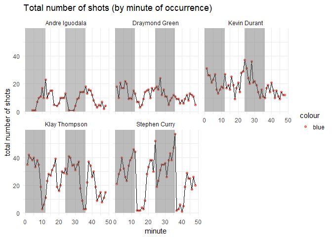

HW02
================
Bryan
March 9, 2018

5.1)

``` r
#total numer of shots by player,arranged in descending order
library(dplyr)
```

    ## 
    ## Attaching package: 'dplyr'

    ## The following objects are masked from 'package:stats':
    ## 
    ##     filter, lag

    ## The following objects are masked from 'package:base':
    ## 
    ##     intersect, setdiff, setequal, union

``` r
a <- read.csv('/Users/shuai/Stat133/hw-stat133/hw02/data/shots-data.csv')
arrange(
  summarise(
    group_by(a,name),
    totalshots = length(shot_type),
  desc(totalshots)
  ))
```

    ## # A tibble: 5 x 3
    ##   name           totalshots `desc(totalshots)`
    ##   <fct>               <int>              <int>
    ## 1 Andre Igudala         371              - 371
    ## 2 Graymond Green        578              - 578
    ## 3 Kevin Durant          915              - 915
    ## 4 Klay Thompson        1220              -1220
    ## 5 Stephen Curry        1250              -1250

5.2)

``` r
#effective shooting % by player
arrange(
  summarise(
    group_by(a,name),
    totalshots = length(shot_type),
    made = sum(shot_made_flag == "made shot"),
    percent_made = made/ totalshots),
  desc(percent_made)
  )
```

    ## # A tibble: 5 x 4
    ##   name           totalshots  made percent_made
    ##   <fct>               <int> <int>        <dbl>
    ## 1 Kevin Durant          915   495        0.541
    ## 2 Andre Igudala         371   192        0.518
    ## 3 Klay Thompson        1220   575        0.471
    ## 4 Stephen Curry        1250   584        0.467
    ## 5 Graymond Green        578   245        0.424

``` r
#effective shooting % by player: 2pt field goal

arrange(
  summarise(
    group_by(filter(a, shot_type == "2PT Field Goal"),name),
    total2pt = length(shot_type),
    made = sum(shot_made_flag == "made shot"),
    percent_made = made/ total2pt),
  desc(percent_made)
  )
```

    ## # A tibble: 5 x 4
    ##   name           total2pt  made percent_made
    ##   <fct>             <int> <int>        <dbl>
    ## 1 Andre Igudala       210   134        0.638
    ## 2 Kevin Durant        643   390        0.607
    ## 3 Stephen Curry       563   304        0.540
    ## 4 Klay Thompson       640   329        0.514
    ## 5 Graymond Green      346   171        0.494

``` r
#effective shooting $ by player: 3pt field goal

arrange(
  summarise(
    group_by(filter(a, shot_type == "3PT Field Goal"),name),
    total3pt = length(shot_type),
    made = sum(shot_made_flag == "made shot"),
    percent_made = made/ total3pt),
  desc(percent_made)
  )
```

    ## # A tibble: 5 x 4
    ##   name           total3pt  made percent_made
    ##   <fct>             <int> <int>        <dbl>
    ## 1 Klay Thompson       580   246        0.424
    ## 2 Stephen Curry       687   280        0.408
    ## 3 Kevin Durant        272   105        0.386
    ## 4 Andre Igudala       161    58        0.360
    ## 5 Graymond Green      232    74        0.319

6.1)

``` r
#dplyr table
library(ggplot2)

k <- select(
    arrange(
  summarise(
    group_by(a,shot_distance),
    total= length(shot_type),
    made = sum(shot_made_flag == "made shot"),
    made_shot_prop = made/ total)),
    shot_distance,made_shot_prop)

k
```

    ## # A tibble: 56 x 2
    ##    shot_distance made_shot_prop
    ##            <int>          <dbl>
    ##  1             0          0.841
    ##  2             1          0.668
    ##  3             2          0.534
    ##  4             3          0.373
    ##  5             4          0.411
    ##  6             5          0.286
    ##  7             6          0.396
    ##  8             7          0.395
    ##  9             8          0.463
    ## 10             9          0.321
    ## # ... with 46 more rows

``` r
#6.2)

#make a scatterplot with the table and answer questions

ggplot(data = k) + geom_point(aes(x=shot_distance, y=made_shot_prop))
```


1.  It seems that when the distance is between 0 and 5, there is a negative relation between shot\_distance and made\_shot\_prop, however, when the distance is larger than 5, it seems that the two variables are not related.

2.  I can only confim that the claim is true when the distance is small than 5.

3.  around 35

4.  between 0 and 5

<!-- -->

1.  

``` r
# create a facetted graph of hte total number of shots by minute of occurrence

curry <- read.csv('/Users/shuai/Stat133/hw-stat133/hw02/data/stephen-curry.csv',stringsAsFactors = FALSE)
durant <- read.csv('/Users/shuai/Stat133/hw-stat133/hw02/data/kevin-durant.csv',stringsAsFactors = FALSE)
igudala <- read.csv('/Users/shuai/Stat133/hw-stat133/hw02/data/andre-igudala.csv',stringsAsFactors = FALSE)
thompson <- read.csv('/Users/shuai/Stat133/hw-stat133/hw02/data/klay-thompson.csv',stringsAsFactors = FALSE)
green <- read.csv('/Users/shuai/Stat133/hw-stat133/hw02/data/draymond-green.csv',stringsAsFactors = FALSE)
curry <- mutate(curry, minute = 12*period - minutes_remaining)
igudala <- mutate(igudala, minute = 12*period - minutes_remaining)
durant <- mutate(durant, minute = 12*period - minutes_remaining)
green <- mutate(green, minute = 12*period - minutes_remaining)
thompson <- mutate(thompson, minute = 12*period - minutes_remaining)


cu <- summarise(
  group_by(curry, minute),
  total= length(shot_made_flag),name = "Stephen Curry"
  )

ig <- summarise(
  group_by(igudala, minute),
  total= length(shot_made_flag),name = "Andre Iguodala"
  )

du <- summarise(
  group_by(durant, minute),
  total= length(shot_made_flag),name = "Kevin Durant"
  )

th <- summarise(
  group_by(thompson, minute),
  total= length(shot_made_flag),name = "Klay Thompson"
  )

gr <- summarise(
  group_by(green, minute),
  total= length(shot_made_flag),name = "Draymond Green"
  )

h <- rbind(cu,ig,du,th,gr)


plot <- ggplot(data = h ) + geom_point(aes(x= minute, y=total, color="blue"))+facet_wrap(~ name)+geom_path(aes(x= minute, y=total))+geom_rect(xmin=0,xmax=12,ymin=0,ymax=80,alpha= 0.01)+theme_minimal()+geom_rect(xmin=24,xmax=36,ymin=0,ymax=80,alpha= 0.01)+scale_x_continuous()+ggtitle("Total number of shots (by minute of occurrence)")
plot + ylab("total number of shots")
```


