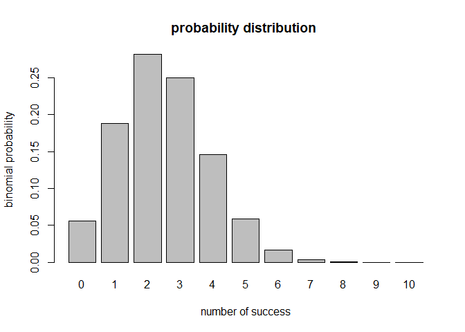
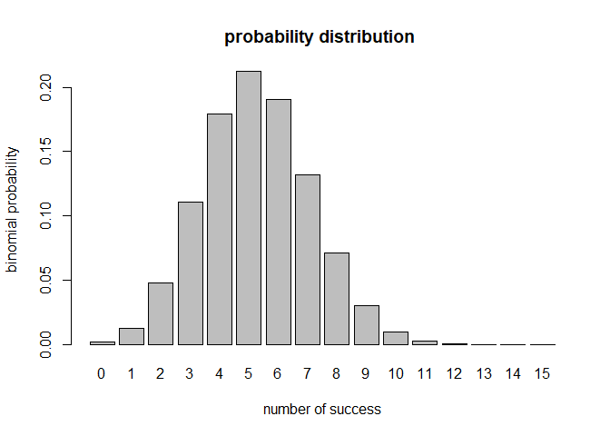

HW03
================
Bryan
March 21, 2018

    # 2.1) write a pipeline to obtain the unique team names

     cut -d "," -f 2 nba2017-roster.csv | tail +2 | sort | uniq  > team-names.txt
     
    head -5 team-names.txt

    #2.2) write a pipeline to obtain the unique positions

     cut -d "," -f 3 nba2017-roster.csv | tail +2 | sort -u > position-names.txt


    head -5 position-names.txt

    #2.3) write a pipeline to obtain the counts of the different experience values

    cut -d "," -f 7 nba2017-roster.csv | tail +2 | sort -n | uniq -c > experience-counts.txt

    head -5 experience-counts.txt

    #2.4) use output redirection commands to create a csv file LAC.csv for the LAC team

    grep -e LAC -e team nba2017-roster.csv > LAC.csv

    #display the age frequencies of LAL players

    grep "LAL" nba2017-roster.csv | cut -d "," -f 6 | sort | uniq -c

    #2.6) write a pipeline to find the numer of players in CLE

    grep "CLE" nba2017-roster.csv| wc -l

    #2.7) write pipelines to create a csv file gsw-height-weight.csv

    grep -e GSW -e player -e height -e weight nba2017-roster.csv | cut -d "," -f 1,4,5 > gsw-height-weight.csv

    cat gsw-height-weight.csv

    #2.8)write pipelines to create a file top10-salaries.csv

    grep -e player -e salary nba2017-roster.csv | cut -d "," -f 1,8 > top10-salaries.csv
    cut -d "," -f 1,8 nba2017-roster.csv | sort -t "," -k 2nr -k 1r | head -n 10 >> top10-salaries.csv

    cat top10-salaries.csv

``` r
source("code/binomial-functions.R")

#find out the probability of getting exactly 3 sixes
bin_probability(n = 10, k = 3, p = 1/6)
```

    ## [1] 0.1550454

``` r
#to obtain the distribution of sixes and plot it
result <- bin_distribution(n = 10, p = 0.25)
result
```

    ##    success  probability
    ## 1        0 5.631351e-02
    ## 2        1 1.877117e-01
    ## 3        2 2.815676e-01
    ## 4        3 2.502823e-01
    ## 5        4 1.459980e-01
    ## 6        5 5.839920e-02
    ## 7        6 1.622200e-02
    ## 8        7 3.089905e-03
    ## 9        8 3.862381e-04
    ## 10       9 2.861023e-05
    ## 11      10 9.536743e-07

``` r
barplot(result[[2]], names.arg = result[[1]], 
        xlab = "number of success",
        ylab = "binomial probability",
        main = "probability distribution ")
```



``` r
#obtain the probability of getting more than 3 heads using a biased coin
result <- 0
for (i in 4:5){
  result <- result + bin_probability(n = 5, k = i, p = 0.35)
}
result
```

    ## [1] 0.0540225

``` r
#obtain the distribution
result <- bin_distribution(n = 15, p = 0.35)
result
```

    ##    success  probability
    ## 1        0 1.562069e-03
    ## 2        1 1.261672e-02
    ## 3        2 4.755531e-02
    ## 4        3 1.109624e-01
    ## 5        4 1.792469e-01
    ## 6        5 2.123387e-01
    ## 7        6 1.905604e-01
    ## 8        7 1.319264e-01
    ## 9        8 7.103729e-02
    ## 10       9 2.975066e-02
    ## 11      10 9.611752e-03
    ## 12      11 2.352527e-03
    ## 13      12 4.222484e-04
    ## 14      13 5.246873e-05
    ## 15      14 4.036056e-06
    ## 16      15 1.448841e-07

``` r
barplot(result[[2]], names.arg = result[[1]], 
        xlab = "number of success",
        ylab = "binomial probability",
        main = "probability distribution ")
```


